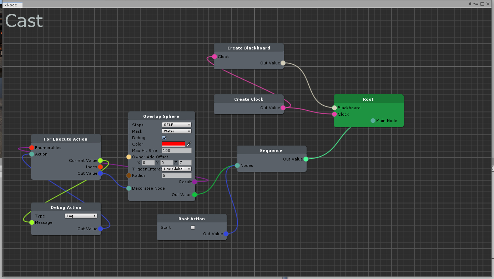
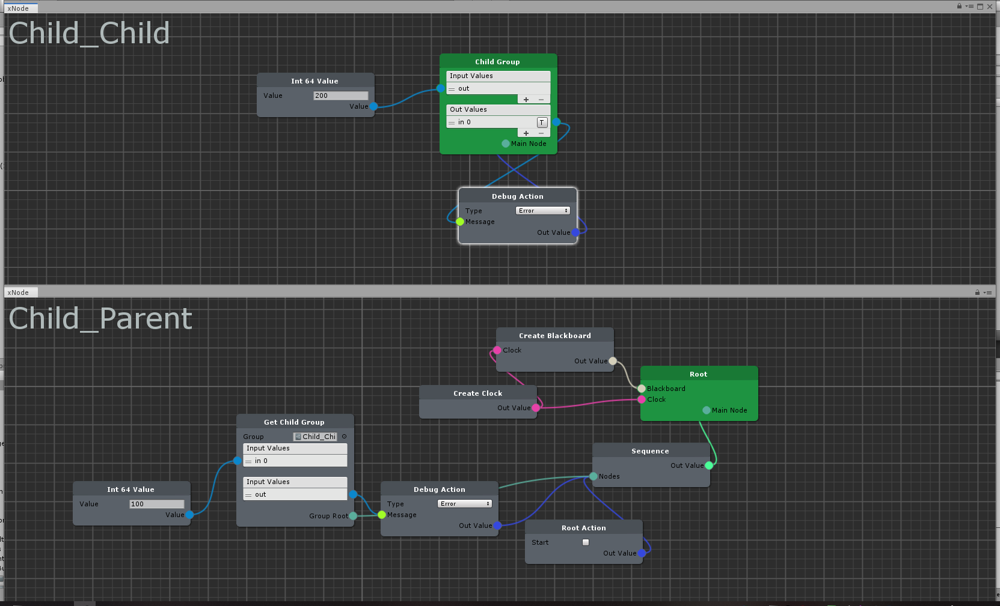
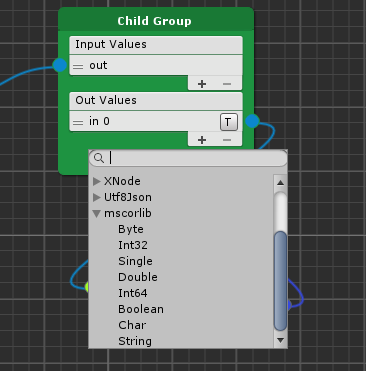
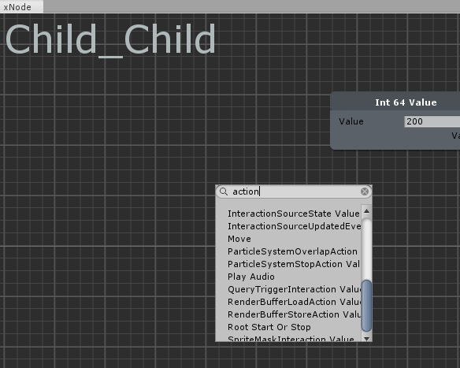
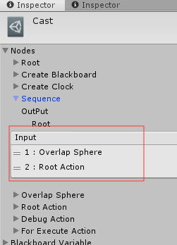
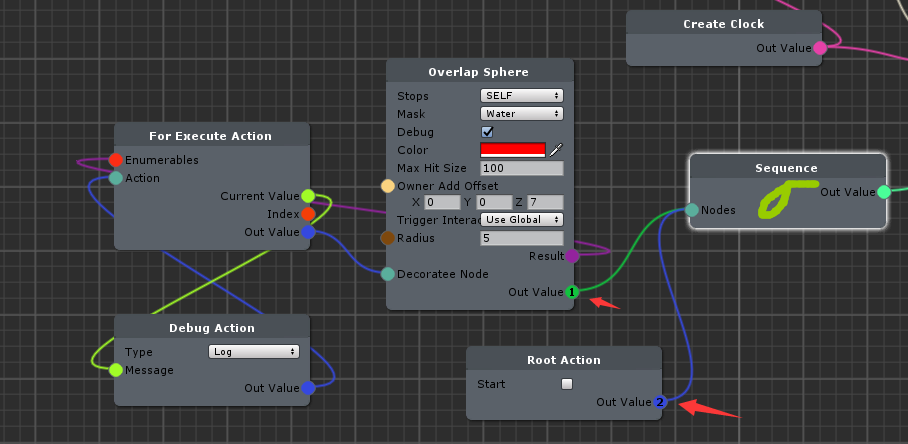
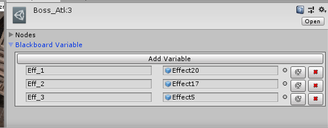

# Termination of maintenance

# SkillSystem

[installation Video](https://www.bilibili.com/video/BV1TJ411771h)

[Trello](https://trello.com/b/DF5JWisg/ic-skill-system)

Behave Tree Create Editor

### 0.8 New Function
SkillGraph Save/Read as Json

New Node `IAutoExecute` It is used for automatic execution, such as battle events, if you need to perform actions on onHide, onDead, you can use it to achieve very intuitively

I provide `InputKeyBoard/InputMouse` Auto Execute Node,To demonstrate how to write your own AutoExecuteNode

Brand new Node life cycle `OnInit`, `OnStart`, `OnStop`

###Skill Group

Cast Node And For Execute Action Node

Child Group And Multi Group Editor Support

Dynamic Type Select Support

Node Search Support

Node Order

Node Order Show

Skill Group Blackboard Variable Support

