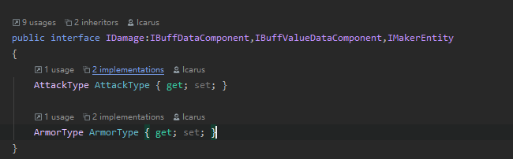
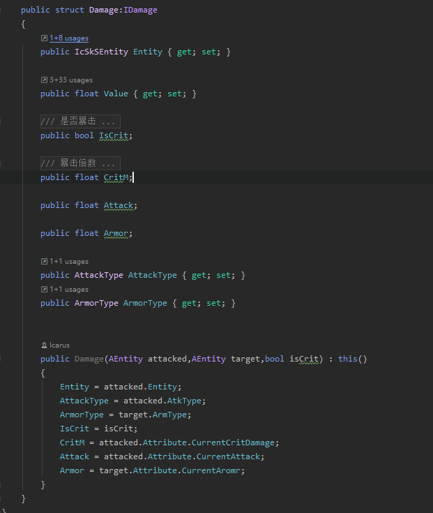
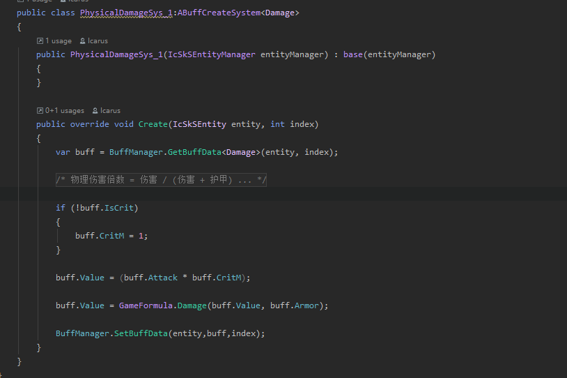
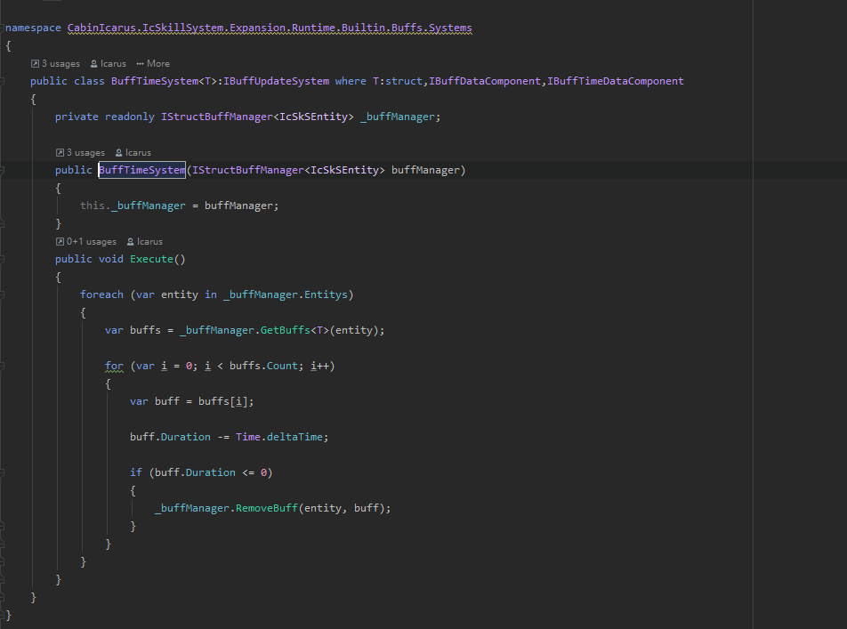
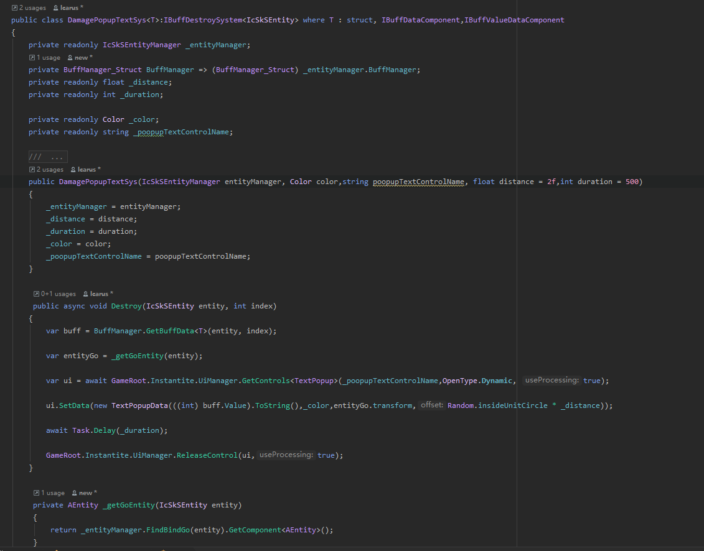
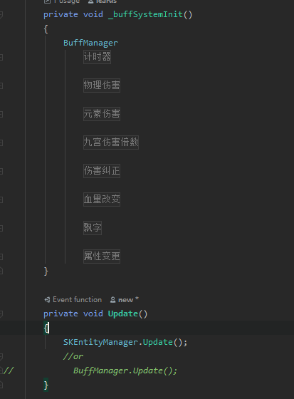
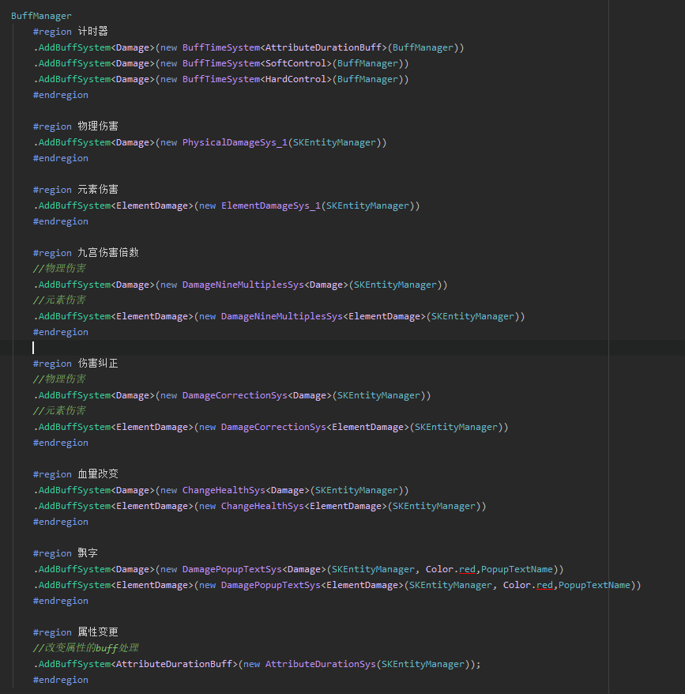
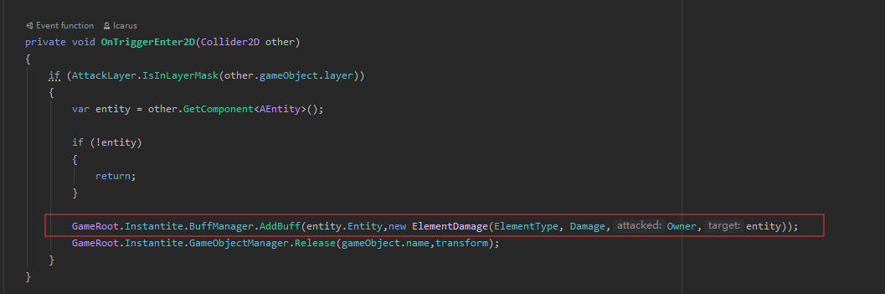

# SkillSystem

[0.6 last Video](https://www.bilibili.com/video/av76312353)

Example Unity Version:2019.2+

Behave Tree Create Editor

Add a new buffManager, the buff needs to be a structure

#### ECS Buff System

##### Create Buff

Implement `IBuffDataComponent`





##### Buff System

Create System Implement `IBuffCreateSystem`



Update System Implement `IBuffUpdateSystem`



Destroy System Implement `IBuffDestroySystem`




##### Buff System

Add Buff System

```c#

BuffManager_Struct BuffManager = new BuffManager_Struct();

BuffManager.AddBuffSystem<TBuff>(new BuffSystem())
```

need Implement custom BuffManager, Implement `IBuffManager`





Add Buff



Remove Buff


###Skill Group

Cast Node And For Execute Action Node


Child Group And Multi Group Editor Support


Dynamic Type Select Support


Node Search Support


Node Order


Node Order Show


Skill Group Blackboard Variable Support


